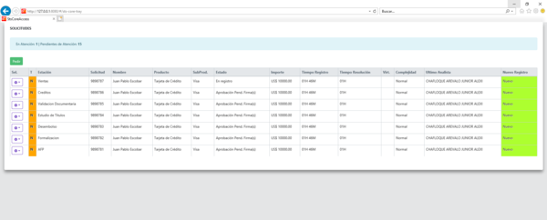


# [](https://angular.io/) STS Micro FrontEnd

[](https://nodesource.com/products/nsolid)

[](https://travis-ci.org/joemccann/dillinger)

The porpouse of this topic is show you how to build your own MicroFrontend Web. This project is integrated for a main angular project and the compression to the component, so-called Domains.
##
## Index

Dillinger is currently extended with the following plugins. Instructions on how to use them in your own application are linked below.
##
## 1. First steps to start in Angular
*Install the necesary softwares.*
##### Install NodeJS (v12.18.2): [](https://nodejs.org/download/release/v12.18.2/)
##### Install Visual Studio Code (v1.47.*): [](https://code.visualstudio.com/updates/v1_47)
##### Exceute the next command line to install ANGULAR:
> nmp install -g @angular/cli@8.3.2
*This command open the possibility to use the "ng" command to generate our Angular project.*

##
## 2. Custom Libraries

To be more efficient and reduce development times we uses a number of bundles built by us to work properly:

* [STSLIBCOVERWEB] - Encryptation & compression tool for **Personally Identifiable Information (PII)**.
* [STSLIBUTILS] - Helpers for the domains projects.

> Remember each library is a complement to be better in this project, if you find some bug, please report us.
##
## 3. Project Structure
```
{domain-name}
	|
	\--	src
		|
		\--	app
			|
			\--	core
				|
				\--	models
				|
				\--	services
				|
			|
			\--	shared
				|
				\--	directives
				|
				\-- helpers
				|
				\--	layouts
				|
				\--	pipes
				| 	
			|
			\--	views
				|
				\--	empty
				|
				\--	{module-a}
				|
			|
			*--	app-routing.module.ts
			*--	app.component.ts
			*--	app.component.spec.ts
			*--	app.constants.ts
			*--	app.module.ts
			|
		|
		\--	assets (resources)
		|
		\--	enviroments
			|
			*--	environment.ts
			*--	environment.prod.ts
			|
		|
		\--	scss (styles files)
		|
		*--	index.html
		*-- main.ts
		*-- polyfills.ts
		*-- polyfills.prod.ts
		|
	|
	*--	angular.json
	*--	copy-libs.js
	*--	package.json
	*--	webpack.externals.js
	|
``` 
##
## 4. Custom environment

When we develop a angular application, we have fases or enviroments. First, the develop phase, then the test phase, the QA phase and for the last, production phase. Every phase have differents directories, configurations maybe, for that we could define a environment. 

1. Create a new environment file.
For example: enviroment.local.ts
```
export  const  environment = {
	production: false,
	STANDALONE: true
};
```
2. Configure your enviroment in `angular.json`
In the section "configuration", we have to define the configuration of our new environment.

3. Finally, to build our application with the custom environment, we have to use the tag *--configuration={environment-name}* in your build script.


##
## 5. Guideline to develop


####  Variables
* Must use lower_snake_case.

>	In this example naming_example to define each variable of type number, string, boolean.
```
	operation_code
	birth_date
```

>	Checkbox type variables must start with the following prefix.
```
	chk_email
```

>	Dropdown type variables must start with the following prefix.
```
	select_department
```

>	Panel type variables must start with the following prefix.
```
	panel_address
```

> 	FormGroup type variables must start with the following prefix.
```
	form_applicant
```

#### Method	
* Must use camelCase to name methods and consider a name similar to the process you are currently viewing.
```
	createUser(){

	}
```
#### Class
* Must use for the class name Pascal.
* Must use lower_snake_case to define each variable within any class(How it comes from the service)
```
	export class Tracking {
		product_code : number;
		subproduct_code: number;
	    evaluation_code: number;
	...
	}
```
#### Service
* Must use camelCase to name the methods of each service, keep in mind the following:
```
	Method Get: getTracking
	Method Post: postTracking
	Method Put: putTracking
	Method Delete: deleteTracking
```
```
	getTracking() {

	}
```
* Must use comment defining each parameter received by the method.
```
	 /**
	 * Get header of tracking
	 * @constructor
	 * @param {number} application_code of application.
	 */
	getTracking(application_code: number) {
		return this.http.get<CustomResponse>(`${this._URLApiBase}tracking/t/${application_code}`);
	}
```
#### Static
* You should use static if your variable or method doesn't change value, it stays with the initial value assigned.

example
```
class Circle {
    static pi: number = 3.14;
    
    static calculateArea(radius:number) {
        return this.pi * radius * radius;
    }
}
Circle.pi; // returns 3.14
Circle.calculateArea(5); // returns 78.5
```

#### ReadOnly
* Prefix readonly is used to make a property as read-only.
```
class Employee {
    readonly emp_code: number;
    emp_name: string;
    
    constructor(code: number, name: string)     {
        this.emp_code = code;
        this.emp_name = name;
    }
}
```
let emp = new Employee(10, "John");
emp.emp_code = 20; //Compiler Error
emp.emp_name = 'Bill'; //Compiler Error

> In the above example, we have the Employee class with two properties- **emp_name** and **emp_code**. Since **emp_code** is read only, it can be initialized at the time of declaration or in the constructor.
If we try to change the value of **emp_code** after the object has been initialized, the compiler shows the following compilation error:
**error TS2540: Cannot assign to emp_code because it is a constant or a read-only property.**

#### Folder
* Must use Kebab Case.
>	hyphens (-) are those that separate the words.
```
	\--	applicant-info
```
#### Object
* Must use Kebab Case.
>	hyphens (-) are those that separate the words.
```
	\--	applicant-info
		*--	applicant-info.component.html
		*--	applicant-info.component.scss
		*--	applicant-info.component.ts
		*--	applicant-info.component.spect.ts
```
##
## 6. Develop a new Domain
> Certainly, we have two kind of projects. A Main Web Project and his respectives domains (Microfrontend).

Before you do the first step, create the route **C:\Fuentes\01Desarrollo\MICROFRONTEND-STS**
Inside create the directory **`domains`**


**1.** Download by the Bitbucket the Microfrontend template project **`sts-core-access`** and the **`sts-libs`**.


Open a console and execute
> **cd C:\Fuentes\01Desarrollo\MICROFRONTEND-STS**

Here clone `sts-libs`
> **git clone {STS-LIBS-URL}** 

Then enter to `domains` directory
> **cd domains**

Here clone `sts-core-access`
> **git clone {STS-CORE-ACCESS-URL}**

**2.** Now, open the `sts-core-access` project and we're going to clean it to only have the necessary.
	
##### 	In `src/app/app-routing.module.ts` and `src/app/app.module.ts`,  delete the references for errors `404` & `500`. 
#####	Then, in "src/app/views", delete the directories `error400` & `error500`.
		
**3.** Change the  name of the project, use `Ctrl + Shift + F`, search `sts-core-access` and replace it for the name of the new domain.

#####  Example: sts-core-tray.

Now, the project is ready to contain the new domain.

#### Is time to add the necessaries components for the new domain. 

**4.** In `src/app/views`, create a new directory. **Example: tray**.
**5.** Inside that directory, add the components necessaries (.ts, .html, .scss).
```
	|
	\-- tray
		|
		|--+ tray.component.html
		|--+ tray.component.scss
		|--+ tray.component.spec.ts
		|--+ tray.component.ts
```
**6.**  In `src/app`, in `app-routing.module.ts` define the domain's routes. 
##### Example: "{ path:  'sts-core-tray', component:  TrayComponent}"
```
const  routes: Routes = [
	{ path:  'sts-core-tray', component:  TrayComponent},
	{ path:  '**', component:  EmptyComponent }
];
```
**7.** In `src/app`, in `app.module.ts`, In the section **declarations** add the new component.
#####  Example: TrayComponent
```
declarations: [
	AppComponent,
	TrayComponent,
	EmptyComponent,
]
```
**8.** For the last, stand by the develop of your domain and open the `sts-libs` project. Inside execute the next commands lines and copy bundles directories.

##### Install the libraries for the project 
> **npm install**

##### Transpile the stslibcoverweb
> **ng build --project stslibcoverweb**

##### Transpile the *stslibutils  
> **ng build --project stslibutils**

This commands generate the bundles of our libs, and we are going to use it in the domain.

**9**. Now, is time to test our application. Open a console and execute.
> **If we create correctly the directories and you followed the previous steps, you shouldn't have any problem.**

##### Install the libraries for the project .
> **npm install**

##### Transpile the domain project.
> **npm run build**

##### Run and see the disaster in :fire::fire::fire:INTERNET EXPLORER :fire::fire::fire:.
> **npm run start**

The result for the example




##
## 7. Dispatch & Listener Events

Every time we configure a new domain, is necessary to know if it is going to consume a backend services. If it is the case, is necessary to have the knowledge of the correct use to Dispatch & Listener Events.

:boom::boom::boom: **TBD** :boom::boom::boom:
##
## 8. Interceptors
:boom::boom::boom: **TBD** :boom::boom::boom:
##
## 9. Custom error pages
:boom::boom::boom: **TBD** :boom::boom::boom:
##
## 10. Storage Provider
### 10.1. How to set in localstorage

:boom::boom::boom: **TBD** :boom::boom::boom:
##
## 11. How to handle "memory leaks"

As our application grows in size and logic, the memory management takes importance and it becomes necessary. For that, we have to follow the next steps to avoid this problem.

### a. Execute the command line.
> npm install @angular-extensions/lint-rules --save-dev

### b. In the tslint.json file add.
```
{
  "extends": [
    "tslint:recommended",
    "@angular-extensions/lint-rules"
  ],
  ...
}
```

For more details visit: [How to create a memory leak in Angular.](https://medium.com/angular-in-depth/how-to-create-a-memory-leak-in-angular-4c583ad78b8b)
##
## 12. Angular Documentation

To generate a correctly documentation, we use the tool **@COMPODOC**. This generate html files where you can find the summary of components, classes, modules and details of our project. 

In the project execute the next line commands.
> npm install -g @compodoc/compodo

>compodoc -p ./tsconfig.json -s

A new folder "Documentation" would be generated and inside all your Angular project are defined.
##
License
----

MIT


**Free Software, Hell Yeah!**

[//]: # (These are reference links used in the body of this note and get stripped out when the markdown processor does its job. There is no need to format nicely because it shouldn't be seen. Thanks SO - http://stackoverflow.com/questions/4823468/store-comments-in-markdown-syntax)

   [PII]: <[https://piwik.pro/blog/what-is-pii-personal-data/](https://piwik.pro/blog/what-is-pii-personal-data/)>

