# [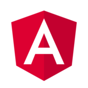](https://angular.io/) STS Micro FrontEnd

[](https://nodesource.com/products/nsolid)

[](https://travis-ci.org/joemccann/dillinger)

The porpouse of this topic is show you how to build your own MicroFrontend Web. This project is integrated for a main angular project and the compression to the component, so-called Domains.
##
## Index

Dillinger is currently extended with the following plugins. Instructions on how to use them in your own application are linked below.
##
## 1. First steps to start in Angular

### *Install the necesary softwares.*
#### Install NodeJS: [](https://nodejs.org/es/download/)
#### Install Visual Studio Code: [](https://code.visualstudio.com/download )
#### Exceute the next command line to install ANGULAR:
> nmp install -g @angular/cli@8.3.2
*This command open the possibility to use the "ng" command to generate our Angular project.*


## 

## 2. Custom Libraries

## 3. Project Structure

## 4. Create a custom enviroment and how to use it

### Create a new enviroment file.
For example: enviroment.local.ts
```
export  const  environment = {
	(DEFINITIONS...)
};
```
### Configure your enviroment in `angular.json`
```
{...
	"project":{
		{project-name}:{...
			"architect":{
				"build":{...
					"configurations":{
						{enviroment}:{
							(CONFIGURATIONS...)
						}
					}
				}
			}
		}
	}
}
```
For build our application with the custom environment, we have to use the tag *--configuration={environment-name}* in your build script.

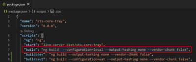


## 5. Guideline to develop

#### Variables
* Must use camelCase to define each variable within any component.
```
	applicationNumber
	birthDate
```
#### Method	
* Must use camelCase to name methods and consider a name similar to the process you are currently viewing.
```
	createUser(){

	}
```
#### Class
* Must use for the class name Pascal.
* Must use lower_snake_case to define each variable within any class(How it comes from the service)
```
	export class Tracking {
		product_code : number;
		subproduct_code: number;
	    evaluation_code: number;
	...
	}
```
#### Service
* Must use camelCase to name the methods of each service, keep in mind the following:
```
	Method Get: getTracking
	Method Post: postTracking
	Method Put: putTracking
	Method Delete: deleteTracking
```
```
	getTracking() {

	}
```
* Must use comment defining each parameter received by the method.
```
	 /**
	 * Get header of tracking
	 * @constructor
	 * @param {number} application - Code of application.
	 */
	getTracking(application: number) {
		return this.http.get<CustomResponse>(`${this._URLApiBase}tracking/t/${application}`);
	}
```
#### Static
* You should use static if your variable or method doesn't change value, it stays with the initial value assigned.

example
```
class Circle {
    static pi: number = 3.14;
    
    static calculateArea(radius:number) {
        return this.pi * radius * radius;
    }
}
Circle.pi; // returns 3.14
Circle.calculateArea(5); // returns 78.5
```

#### ReadOnly
* Prefix readonly is used to make a property as read-only.
```
class Employee {
    readonly empCode: number;
    empName: string;
    
    constructor(code: number, name: string)     {
        this.empCode = code;
        this.empName = name;
    }
}
```
let emp = new Employee(10, "John");
emp.empCode = 20; //Compiler Error
emp.empName = 'Bill'; //Compiler Error

*In the above example, we have the Employee class with two properties- empName and empCode. Since empCode is read only, it can be initialized at the time of declaration or in the constructor.
If we try to change the value of empCode after the object has been initialized, the compiler shows the following compilation error:
error TS2540: Cannot assign to empCode' because it is a constant or a read-only property.

## 6. Main Web & Domains
In this section, we're going to learn how to develop correctly our Domains and how generate a javascript file to be consumed for our Main Web.

### Step Zero: *Define the directory where we are going to develop*
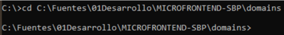 

### Step One: *Execute the line command and create a new project.*
> ng new {project-name} 
> For example: ng new web-sts


### Step Three: *Send "y" to the angular router file and select "SCSS" in the console.*
 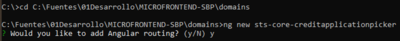
 
 
 
This selected options load the basic configurations.
 
 

### Step Four: *Open the project's directory in Visual Studio Code and start adding the configurations for our project.*
  

### Step Five: *Modify the* `angular.json` *.*
  We need to define the way that the project is gonna be built. For that, follow the next steps.
```
MODIFY:
{
	"project":{
		"{name-project}":{
			"architec":{ 
				"build"{
					"builder": "ngx-build-plus:browser",
					"option":{
						"styles":[
							"node_modules/font-awesome/css/font-awesome.css",
							"src/scss/style.scss"
							]
					...},
					"configuration":{
						"production":{
							"fileReplacements": [
								{
									"replace": "src/polyfills.ts",
									"with": "src/polyfills.prod.ts"
								}
								{
									"replace": "src/environments/environment.ts",
									"with": "src/environments/environment.prod.ts"
								},
							...]
						...}
					...}
				...},
				"serve":{
					"builder": "ngx-build-plus:dev-server",
				...}
			...}
		...} 
	...}
}
```
  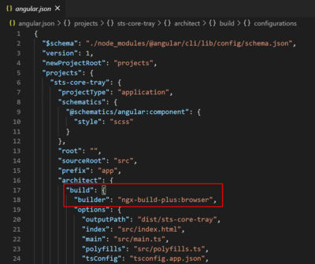


### Step Six: *Modify the `package.json`  file.*
```
{
	"name": "{project-name}",
	"version": "0.0.0",
	"scripts": {
		...,
		"start": "live-server dist/{project-name}",
		"build": "ng build --prod --output-hashing none --vendor-chunk false",
		...
	},
	"resolutions": {
		"yargs-parser": "^13.1.2"
	},
	"private": true,
	"dependencies": {
		"@angular/animations": "~8.2.4",
		"@angular/cdk": "^8.0.0",
		"@angular/common": "~8.2.4",
		"@angular/compiler": "~8.2.4",
		"@angular/core": "~8.2.4",
		"@angular/elements": "^8.2.14",
		"@angular/forms": "~8.2.4",
		"@angular/platform-browser": "~8.2.4",
		"@angular/platform-browser-dynamic": "~8.2.4",
		"@angular/router": "~8.2.4",
		"@auth0/angular-jwt": "^3.0.1",
		"@coreui/angular": "^2.7.3",
		"@coreui/coreui": "^2.1.16",
		"@ng-bootstrap/ng-bootstrap": "^5.1.5",
		"@swimlane/ngx-datatable": "16.1.1",
		"@syncfusion/ej2-angular-richtexteditor": "^17.4.44",
		"@webcomponents/custom-elements": "^1.4.2",
		"@webcomponents/webcomponentsjs": "^2.2.10",
		"angular-font-awesome": "^3.1.2",
		"bootstrap": "^4.4.1",
		"classlist.js": "^1.1.20150312",
		"compodoc": "0.0.41",
		"copy": "^0.3.2",
		"core-js": "^2.6.9",
		"crypto-browserify": "^3.12.0",
		"crypto-js": "^4.0.0",
		"custom-event": "^1.0.1",
		"custom-event-polyfill": "^1.0.7",
		"date-fns": "^2.9.0",
		"document-register-element": "^1.14.3",
		"font-awesome": "^4.7.0",
		"jsencrypt": "^3.0.0-rc.1",
		"live-server": "^1.2.1",
		"mutationobserver-shim": "^0.3.3",
		"ng6-toastr-notifications": "^1.0.4",
		"ngx-bootstrap": "^5.6.1",
		"ngx-perfect-scrollbar": "^8.0.0",
		"ngx-spinner": "^8.1.0",
		"pako": "^1.0.11",
		"rxjs": "~6.4.0",
		"secure-ls": "^1.2.6",
		"sjcl": "^1.0.8",
		"stslibcoverweb": "file:../../sts-libs/dist/stslibcoverweb",
		"stslibutils": "file:../../sts-libs/dist/stslibutils",
		"tslib": "^1.10.0",
		"web-animations-js": "^2.3.2",
		"webpack-dev-server": "^3.1.14",
		"zone.js": "~0.9.1"
	},
	"devDependencies": {
		"@angular-devkit/build-angular": "~0.803.2",
		"@angular/cli": "~8.3.2",
		"@angular/compiler-cli": "~8.2.4",
		"@angular/language-service": "~8.2.4",
		"@types/jasmine": "~3.3.8",
		"@types/jasminewd2": "~2.0.3",
		"@types/node": "~8.9.4",
		"codelyzer": "^5.0.0",
		"jasmine-core": "~3.4.0",
		"jasmine-spec-reporter": "~4.2.1",
		"karma": "^5.0.4",
		"karma-chrome-launcher": "~2.2.0",
		"karma-coverage-istanbul-reporter": "~2.0.1",
		"karma-jasmine": "~2.0.1",
		"karma-jasmine-html-reporter": "^1.4.0",
		"ngx-build-plus": "^9.0.6",
		"protractor": "^7.0.0",
		"ts-node": "~7.0.0",
		"tslint": "~5.15.0",
		"typescript": "~3.5.3"
	}
}
```

### Step Seven: *Modify the `polyfill.ts` file*
```
/**
* This file includes polyfills needed by Angular and is loaded before the app.
* You can add your own extra polyfills to this file.
* This file is divided into 2 sections:
* 1. Browser polyfills. These are applied before loading ZoneJS and are sorted by browsers.
* 2. Application imports. Files imported after ZoneJS that should be loaded before your main
* file.
* The current setup is for so-called "evergreen" browsers; the last versions of browsers that
* automatically update themselves. This includes Safari >= 10, Chrome >= 55 (including Opera),
* Edge >= 13 on the desktop, and iOS 10 and Chrome on mobile.
* Learn more in https://angular.io/guide/browser-support
*/
/***************************************************************************************************
* BROWSER POLYFILLS
*/
/** IE9, IE10 and IE11 requires all of the following polyfills. **/
import  'core-js/es6/symbol';
import  'core-js/es6/object';
import  'core-js/es6/function';
import  'core-js/es6/parse-int';
import  'core-js/es6/parse-float';
import  'core-js/es6/number';
import  'core-js/es6/math';
import  'core-js/es6/string';
import  'core-js/es6/date';
import  'core-js/es6/array';
import  'core-js/es6/regexp';
import  'core-js/es6/map';
import  'core-js/es6/weak-map';
import  'core-js/es6/set';
import  'core-js/es7/array';
import  'core-js/es7/object';
/** IE10 and IE11 requires the following for the Reflect API. */
import  'core-js/es6/reflect';
// for IE10
import  'mutationobserver-shim';
/** IE10 and IE11 requires the following for NgClass support on SVG elements */
import  'classlist.js'; // Run `npm install --save classlist.js`.
/**
* Web Animations `@angular/platform-browser/animations`
* Only required if AnimationBuilder is used within the application and using IE/Edge or Safari.
* Standard animation support in Angular DOES NOT require any polyfills (as of Angular 6.0).
*/
import  'web-animations-js'; // Run `npm install --save web-animations-js`.
/**
* By default, zone.js will patch all possible macroTask and DomEvents
* user can disable parts of macroTask/DomEvents patch by setting following flags
* because those flags need to be set before `zone.js` being loaded, and webpack
* will put import in the top of bundle, so user need to create a separate file
* in this directory (for example: zone-flags.ts), and put the following flags
* into that file, and then add the following code before importing zone.js.
* import './zone-flags.ts';
* The flags allowed in zone-flags.ts are listed here.
* The following flags will work for all browsers.
*/
(window  as  any).__Zone_disable_requestAnimationFrame = true; // disable patch requestAnimationFrame
(window  as  any).__Zone_disable_on_property = true; // disable patch onProperty such as onclick
(window  as  any).__zone_symbol__UNPATCHED_EVENTS = ['scroll', 'mousemove']; // disable patch specified eventNames
/*
* in IE/Edge developer tools, the addEventListener will also be wrapped by zone.js
* with the following flag, it will bypass `zone.js` patch for IE/Edge
*/
(window  as  any).__Zone_enable_cross_context_check = true;
/*
*/
/**********************************************************************************
* Zone JS is required by default for Angular itself.
import  'zone.js/dist/zone'; // Included with Angular CLI.
/**************************************************************************************
* APPLICATION IMPORTS
*/
// IE
import  '@webcomponents/custom-elements/custom-elements.min';
//CustomEvent
import  'custom-event-polyfill';
```
### Step Eight: Create a javascript file `copy-libs.js`. This file copy de necessary libs to the assets, there the project use it to be launch.

```
const  copy = require('copy');
console.log('Copy libraries to project');
copy('node_modules/@webcomponents/custom-elements/src/native-shim.js', 'src/assets', {}, _  => {});
copy('node_modules/rxjs/bundles/rxjs.umd.js', 'src/assets', {}, _  => {});
copy('node_modules/@angular/core/bundles/core.umd.js', 'src/assets', {}, _  => {});
copy('node_modules/@angular/common/bundles/common.umd.js', 'src/assets', {}, _  => {});
copy('node_modules/@angular/common/bundles/common-http.umd.js', 'src/assets', {}, _  => {});
copy('node_modules/@angular/compiler/bundles/compiler.umd.js', 'src/assets', {}, _  => {});
copy('node_modules/@angular/elements/bundles/elements.umd.js', 'src/assets', {}, _  => {});
copy('node_modules/@angular/platform-browser/bundles/platform-browser.umd.js', 'src/assets', {}, _  => {});
copy('node_modules/@angular/platform-browser-dynamic/bundles/platform-browser-dynamic.umd.js', 'src/assets', {}, _  => {});
copy('node_modules/crypto-js/crypto-js.js', 'src/assets', {}, _  => {});
copy('node_modules/sjcl/sjcl.js', 'src/assets', {}, _  => {});
copy('node_modules/secure-ls/dist/secure-ls.min.js', 'src/assets', {}, _  => {});
copy('node_modules/@webcomponents/custom-elements/src/native-shim.js.map', 'src/assets', {}, _  => {});
copy('node_modules/rxjs/bundles/rxjs.umd.js.map', 'src/assets', {}, _  => {});
copy('node_modules/@angular/core/bundles/core.umd.js.map', 'src/assets', {}, _  => {});
copy('node_modules/@angular/common/bundles/common.umd.js.map', 'src/assets', {}, _  => {});
copy('node_modules/@angular/common/bundles/common-http.umd.js.map', 'src/assets', {}, _  => {});
copy('node_modules/@angular/compiler/bundles/compiler.umd.js.map', 'src/assets', {}, _  => {});
copy('node_modules/@angular/elements/bundles/elements.umd.js.map', 'src/assets', {}, _  => {});
copy('node_modules/@angular/platform-browser/bundles/platform-browser.umd.js.map', 'src/assets', {}, _  => {});
copy('node_modules/@angular/platform-browser-dynamic/bundles/platform-browser-dynamic.umd.js.map', 'src/assets', {}, _  => {});
copy('node_modules/crypto-js/crypto-js.js.map', 'src/assets', {}, _  => {});
copy('node_modules/sjcl/sjcl.js.map', 'src/assets', {}, _  => {});
copy('node_modules/secure-ls/dist/secure-ls.min.js.map', 'src/assets', {}, _  => {});
```
### Step Nine: Create a javascript file `webpack.externals.js`. This file define the shared libraries into domain and main web.
```
const  webpack = require('webpack');

module.exports =
{
	"externals": {
		"rxjs":  "rxjs",
		"@angular/core":  "ng.core",
		"@angular/common":  "ng.common",
		"@angular/common/http":  "ng.common.http",
		"@angular/platform-browser":  "ng.platformBrowser",
		"@angular/platform-browser-dynamic":  "ng.platformBrowserDynamic",
		"@angular/compiler":  "ng.compiler",
		"@angular/elements":  "ng.elements",
		"crypto-js":'CryptoJS',
		"sjcl":'sjcl',
		"secure-ls":  "SecureLS",
		"stslibcoverweb":"stslibcoverweb",
		"stslibutils":"stslibutils",
		"zone.js":  'Zone'
		// Uncomment and add to scripts in angular.json if needed
		// "@angular/router": "ng.router",
		// "@angular/forms": "ng.forms"
	}
}
```

### Step Ten: *Create a* `polyfills.prod.ts` *this file is empty. This file is going to replace the* `polyfills.ts` *in the production enviroment. Just a trick for production enviroment.*


### Step Eleven: *Modify the* `tsconfig.json`
Importan!
The "target" script need to be "es5" if we needed to launch our web in older browsers, at once, the polyfills.ts file define the necesary libraries to run correctly there.
```
{
	"compileOnSave": false,
	"compilerOptions": {
		"baseUrl": "./",
		"paths": {
			"crypto": [
			"node_modules/crypto-js"
			]
		},
		"outDir": "./dist/out-tsc",
		"sourceMap": true,
		"declaration": false,
		"downlevelIteration": true,
		"experimentalDecorators": true,
		"module": "esnext",
		"moduleResolution": "node",
		"importHelpers": true,
		"target": "es5",
		"typeRoots": [
			"node_modules/@types"
		],
		"lib": [
			"es2018",
			"dom"
		]
	},
	"angularCompilerOptions": {
		"fullTemplateTypeCheck": true,
		"strictInjectionParameters": true
	}
}
```
### Step Twelve: *Excute the lines commands*
> npm install

> npx npm-force-resolutions

> npm update @webpack-dev-server@3.1.14)

### 6.1. Create a Domain


### We create the folder "core" and "shared" with their corresponding objects:


### Now we enter the following command where we will create our component.
> ng g c views/CreditApplicationPicker --dry-run


> ng g c views/CreditApplicationPicker


### Now we enter the following command where we will create the empty component.
> ng g c views/empty --inline-template --inline-style --dry-run 


If everything is correct we proceed to create it.
> ng g c views/empty --inline-template --inline-style


### We update our routing with the necessary routes.

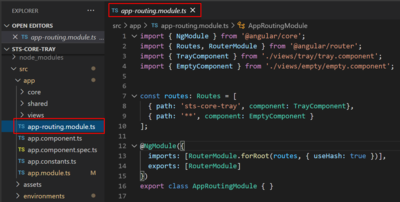

### Delete the object "app.component.html" as it would not be necessary for the domain.


### Delete the object "app.component.css as it would not be necessary for the domain.


### We create the object "app.constants.ts"


### Updated the object "app.component.ts"

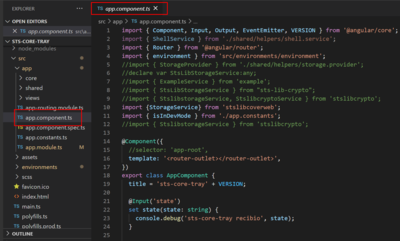

### Updated the "app.module.ts" object.


### We add the domain name as we have it in the "app.module.ts"

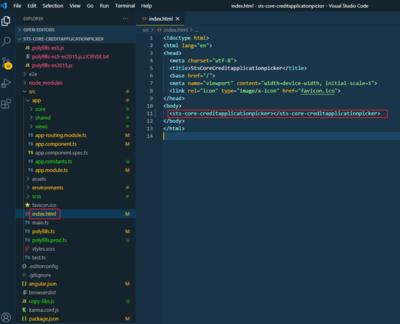

### We comment "enableProdMode ()" when it is run for production.

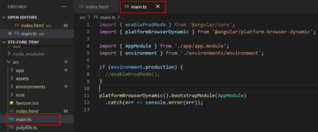

### Run the command, to generate the dist folder with the main.js
> npm run build:externals 


### Change the "main.js" to the domain name "sts-core-creditapplicationpicker.js"

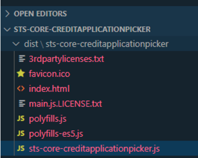

### To approve the domain, we add it to the web "web-sts-mo" and the "assets" folder.


### We add in the "environment.ts" our domain variable.

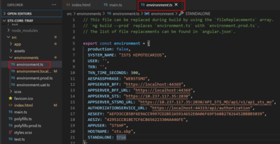

### Agregamos en el “environment.prod.ts” nuestra variable del dominio.

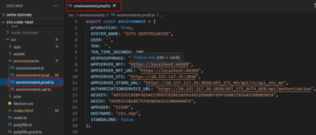

### We add our route in “app.component.ts”


### We add our menu.


### Now, we execute the following command to generate the web dist.
> npm run build:externals


### Now we execute the following command to raise the web and test our domain.
> npm start

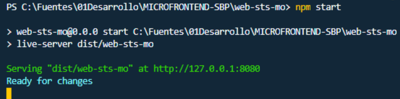

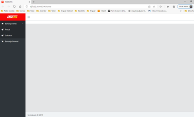

### Click on the "General Tray" menu.

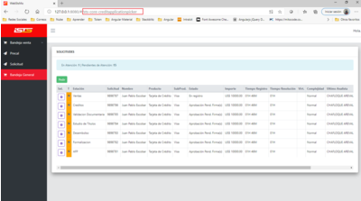

#### 6.1.1. Create a custom library

For this project, we use two custom libraries. One for crypt and compress data through a interceptor's logic, and other for utility helpers necessaries to the correctly performances.

To create a new library project, execute.
> ng new {workspace-name} --create-application=false

> cd {workspace-name}

> ng generate library {library-name}

Inside the project, we are going to see this structure.


In the example image, we have the two libraries mentionated in the beginning.

There, the project have a src/lib directory where we are going to create our services with the logic necessary.


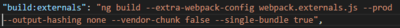

At the same time, in the project, in the `public-api.ts` we have to define the services to expose in our library.

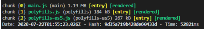

To configure the build and the dependencies, `angular.json` and `package.json` files work equal just like a application project.

#### 6.1.2. Create a shared library

In a microfrontend design, the proyects have them own dependencies, and works alones structures and develop for the correspondent team. But, in performance and loading time, we are duplicating the code, into the future this could be negative.
BUT! there are a solution for that, called WEBPACK. Is a file where we put all the libraries we share between domains and the main web.

Here a example in our project: 


`webpack.externals.js`
```
const  webpack = require('webpack');

module.exports =
{
	"externals": {
		"rxjs":  "rxjs",
		"@angular/core":  "ng.core",
		"@angular/common":  "ng.common",
		"@angular/common/http":  "ng.common.http",
		"@angular/platform-browser":  "ng.platformBrowser",
		"@angular/platform-browser-dynamic":  "ng.platformBrowserDynamic",
		"@angular/compiler":  "ng.compiler",
		"@angular/elements":  "ng.elements",
		"crypto-js":'CryptoJS',
		"sjcl":'sjcl',
		"secure-ls":  "SecureLS",
		"stslibcoverweb":"stslibcoverweb",
		"stslibutils":"stslibutils",
		"zone.js":  'Zone'
		// Uncomment and add to scripts in angular.json if needed
		// "@angular/router": "ng.router",
		// "@angular/forms": "ng.forms"
	}
}
```
And, how we use that in the project? Go to the `package.json` and verify you have installed `ngx-build-plus`. If not, run the command line:
> ng add ngx-build-plus

And add in the scripts:
> "build:externals": "ng build --extra-webpack-config {webpack-name}.js --prod --output-hashing none --vendor-chunk false --single-bundle true"

By last, in the console, execute:
> npm run build:externals

For more details, visit: 
#### 6 Steps to your Angular-based Microfrontend Shell
[6 Steps to your Angular-based Microfrontend Shell](https://www.angulararchitects.io/aktuelles/6-steps-to-your-angular-based-microfrontend-shell/)

#### Your options for building Angular Elements with the CLI
[Your options for building Angular Elements with the CLI](https://www.angulararchitects.io/aktuelles/your-options-for-building-angular-elements/)

### 6.2. Create a Domain with SubDomain
What is a `subdomain`?
Well, in a microfrontend we have a main web and diferents domains, but sometimes, this domains consume other domain. So, what have we to do for that?

All the domains have a CustomElement created in `app.module.ts` file. Inside is defined an ID.
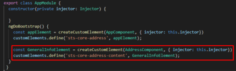
This code open our domain to be consumed for others domains. 

Now, in the domain, in the HTML file  add the tag with the ID.


### 6.3. Configure Site Application

## 7. Dispatch & Listener Events

## 8. Interceptors? What the hell is that?


## 9. Custom error pages

## 10. Storage Provider
### 10.1. How to set in localstorage

License
----

MIT


**Free Software, Hell Yeah!**

[//]: # (These are reference links used in the body of this note and get stripped out when the markdown processor does its job. There is no need to format nicely because it shouldn't be seen. Thanks SO - http://stackoverflow.com/questions/4823468/store-comments-in-markdown-syntax)


   [dill]: <https://github.com/joemccann/dillinger>
   [git-repo-url]: <https://github.com/joemccann/dillinger.git>
   [john gruber]: <http://daringfireball.net>
   [df1]: <http://daringfireball.net/projects/markdown/>
   [markdown-it]: <https://github.com/markdown-it/markdown-it>
   [Ace Editor]: <http://ace.ajax.org>
   [node.js]: <http://nodejs.org>
   [Twitter Bootstrap]: <http://twitter.github.com/bootstrap/>
   [jQuery]: <http://jquery.com>
   [@tjholowaychuk]: <http://twitter.com/tjholowaychuk>
   [express]: <http://expressjs.com>
   [AngularJS]: <http://angularjs.org>
   [Gulp]: <http://gulpjs.com>

   [PlDb]: <https://github.com/joemccann/dillinger/tree/master/plugins/dropbox/README.md>
   [PlGh]: <https://github.com/joemccann/dillinger/tree/master/plugins/github/README.md>
   [PlGd]: <https://github.com/joemccann/dillinger/tree/master/plugins/googledrive/README.md>
   [PlOd]: <https://github.com/joemccann/dillinger/tree/master/plugins/onedrive/README.md>
   [PlMe]: <https://github.com/joemccann/dillinger/tree/master/plugins/medium/README.md>
   [PlGa]: <https://github.com/RahulHP/dillinger/blob/master/plugins/googleanalytics/README.md>

